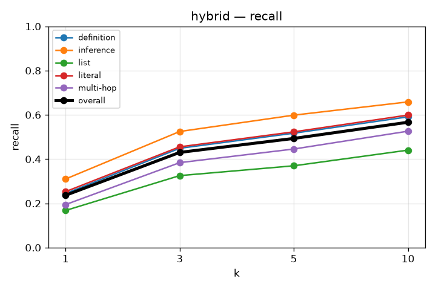
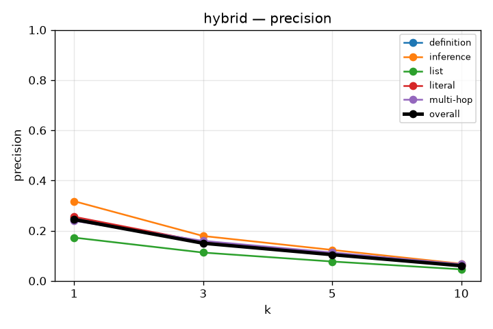
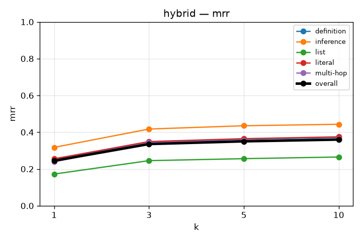
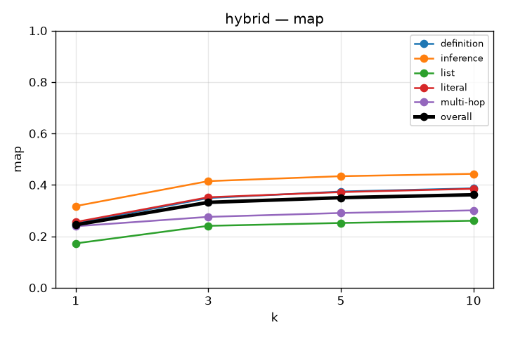
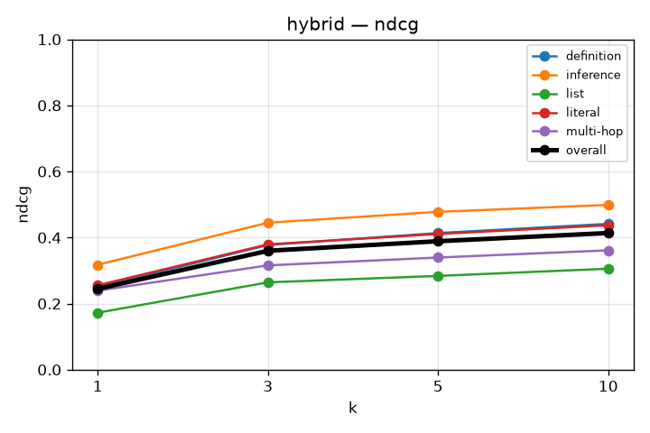

# RAG Retrieval Evaluation

## hybrid
`kb_id=ilfhfGlH4N5PCx1MZMuFt`
{
  "chunkingMethod": "semantic",
  "maxChunkSize": 1024,
  "minChunkSize": 512,
  "indexTypes": ["bm25"]
}
Experiment is done with simple whitespace splitter using this reges: return re.findall(r"\w+", text.lower()): exp 1

### recall

| k | overall | definition | inference | list | literal | multi-hop |
|---|---|---|---|---|---|---|
| 1 | 0.236 | 0.244 | 0.310 | 0.168 | 0.253 | 0.194 |
| 3 | 0.430 | 0.449 | 0.525 | 0.325 | 0.455 | 0.384 |
| 5 | 0.493 | 0.517 | 0.599 | 0.370 | 0.523 | 0.445 |
| 10 | 0.567 | 0.591 | 0.658 | 0.440 | 0.599 | 0.526 |

### precision

| k | overall | definition | inference | list | literal | multi-hop |
|---|---|---|---|---|---|---|
| 1 | 0.245 | 0.250 | 0.318 | 0.172 | 0.255 | 0.239 |
| 3 | 0.150 | 0.155 | 0.179 | 0.113 | 0.156 | 0.159 |
| 5 | 0.104 | 0.110 | 0.123 | 0.077 | 0.109 | 0.113 |
| 10 | 0.060 | 0.064 | 0.068 | 0.046 | 0.063 | 0.067 |

### mrr

| k | overall | definition | inference | list | literal | multi-hop |
|---|---|---|---|---|---|---|
| 1 | 0.245 | 0.250 | 0.318 | 0.172 | 0.255 | 0.239 |
| 3 | 0.336 | 0.345 | 0.417 | 0.245 | 0.349 | 0.343 |
| 5 | 0.350 | 0.362 | 0.435 | 0.256 | 0.365 | 0.354 |
| 10 | 0.360 | 0.372 | 0.443 | 0.265 | 0.375 | 0.363 |

### map

| k | overall | definition | inference | list | literal | multi-hop |
|---|---|---|---|---|---|---|
| 1 | 0.245 | 0.250 | 0.318 | 0.172 | 0.255 | 0.239 |
| 3 | 0.332 | 0.349 | 0.415 | 0.241 | 0.352 | 0.276 |
| 5 | 0.350 | 0.374 | 0.434 | 0.252 | 0.372 | 0.291 |
| 10 | 0.362 | 0.387 | 0.443 | 0.261 | 0.385 | 0.301 |

### ndcg

| k | overall | definition | inference | list | literal | multi-hop |
|---|---|---|---|---|---|---|
| 1 | 0.245 | 0.250 | 0.318 | 0.172 | 0.255 | 0.239 |
| 3 | 0.360 | 0.377 | 0.445 | 0.264 | 0.379 | 0.316 |
| 5 | 0.389 | 0.414 | 0.478 | 0.284 | 0.411 | 0.339 |
| 10 | 0.414 | 0.441 | 0.499 | 0.306 | 0.437 | 0.361 |

