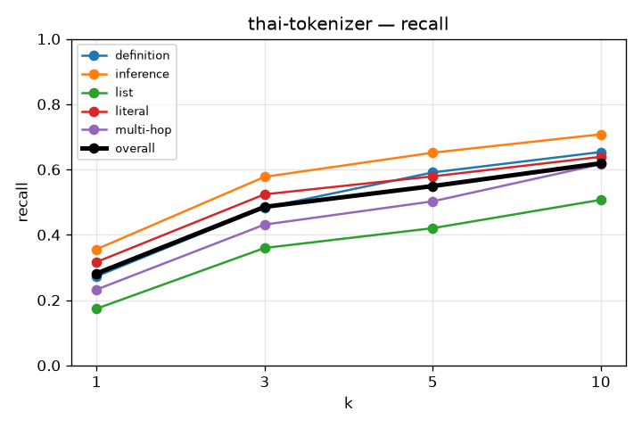
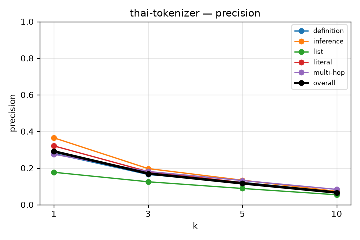
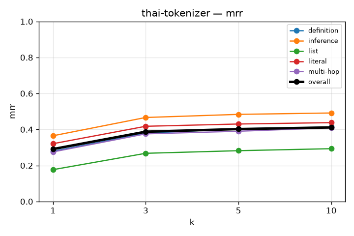
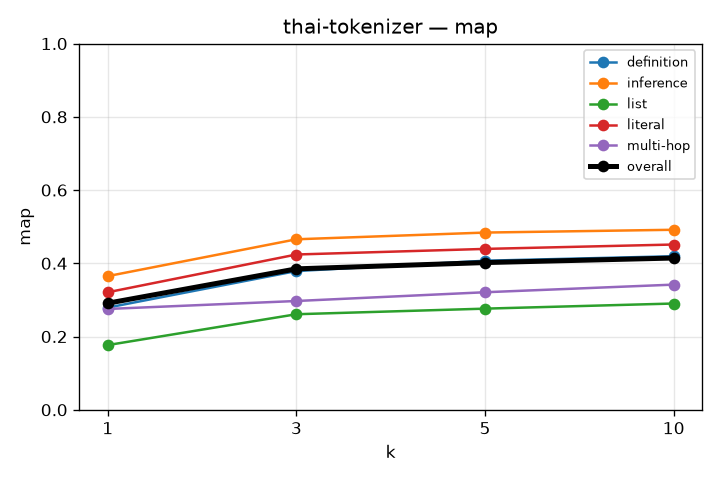
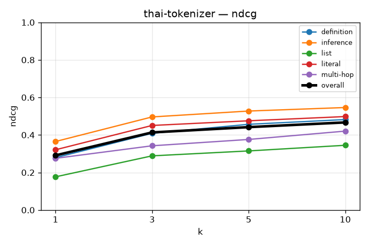

# RAG Retrieval Evaluation

## thai-tokenizer
`kb_id=xgqnImqNxTB9GDSUDpyRd`

```json
{
  "chunkingMethod": "semantic",
  "maxChunkSize": 1024,
  "minChunkSize": 512,
  "indexTypes": [
    "bm25"
  ]
}
```
Experiment is done with thai specific word tokenizer from pythainlp lib. exp 2

### recall

| k | overall | definition | inference | list | literal | multi-hop |
|---|---|---|---|---|---|---|
| 1 | 0.281 | 0.273 | 0.356 | 0.174 | 0.317 | 0.232 |
| 3 | 0.486 | 0.483 | 0.577 | 0.360 | 0.524 | 0.431 |
| 5 | 0.549 | 0.591 | 0.651 | 0.420 | 0.579 | 0.502 |
| 10 | 0.619 | 0.653 | 0.708 | 0.507 | 0.639 | 0.616 |



### precision

| k | overall | definition | inference | list | literal | multi-hop |
|---|---|---|---|---|---|---|
| 1 | 0.291 | 0.279 | 0.365 | 0.177 | 0.321 | 0.275 |
| 3 | 0.170 | 0.165 | 0.197 | 0.125 | 0.181 | 0.181 |
| 5 | 0.116 | 0.122 | 0.134 | 0.088 | 0.120 | 0.132 |
| 10 | 0.066 | 0.069 | 0.073 | 0.054 | 0.067 | 0.083 |



### mrr

| k | overall | definition | inference | list | literal | multi-hop |
|---|---|---|---|---|---|---|
| 1 | 0.291 | 0.279 | 0.365 | 0.177 | 0.321 | 0.275 |
| 3 | 0.388 | 0.379 | 0.467 | 0.268 | 0.418 | 0.376 |
| 5 | 0.402 | 0.404 | 0.484 | 0.282 | 0.430 | 0.390 |
| 10 | 0.411 | 0.414 | 0.492 | 0.293 | 0.438 | 0.409 |



### map

| k | overall | definition | inference | list | literal | multi-hop |
|---|---|---|---|---|---|---|
| 1 | 0.291 | 0.279 | 0.365 | 0.177 | 0.321 | 0.275 |
| 3 | 0.385 | 0.379 | 0.466 | 0.261 | 0.424 | 0.297 |
| 5 | 0.402 | 0.407 | 0.484 | 0.276 | 0.439 | 0.321 |
| 10 | 0.414 | 0.419 | 0.492 | 0.290 | 0.451 | 0.342 |



### ndcg

| k | overall | definition | inference | list | literal | multi-hop |
|---|---|---|---|---|---|---|
| 1 | 0.291 | 0.279 | 0.365 | 0.177 | 0.321 | 0.275 |
| 3 | 0.413 | 0.409 | 0.496 | 0.289 | 0.451 | 0.342 |
| 5 | 0.442 | 0.457 | 0.527 | 0.315 | 0.475 | 0.376 |
| 10 | 0.467 | 0.482 | 0.546 | 0.345 | 0.498 | 0.420 |


