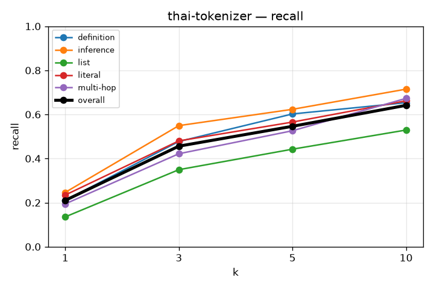
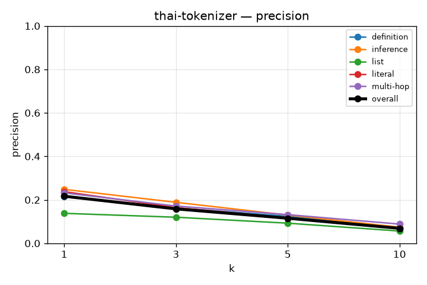
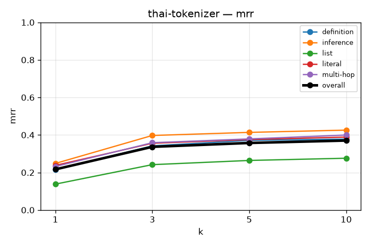
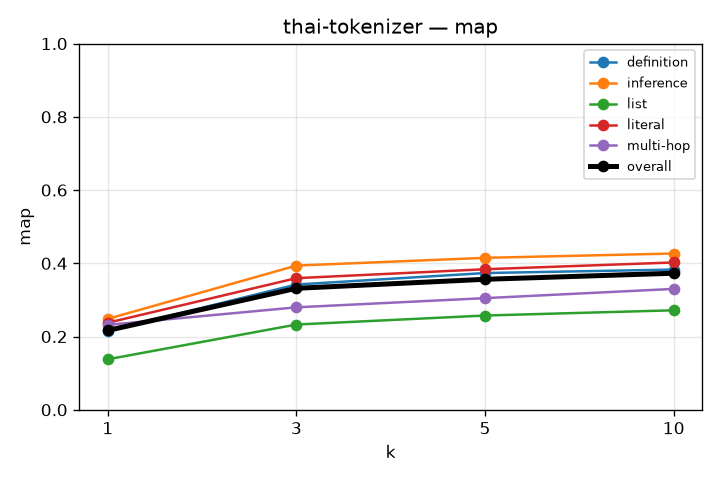
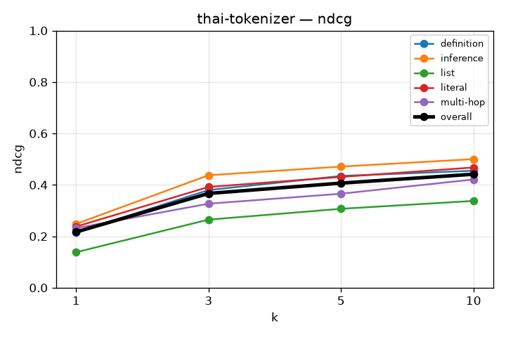

# RAG Retrieval Evaluation

## thai-tokenizer
`kb_id=LPEGLwdDpkKdOk7oNsMaj`

```json
{
  "chunkingMethod": "semantic",
  "maxChunkSize": 1024,
  "minChunkSize": 512,
  "indexTypes": [
    "bm25"
  ]
}
```
Experiment is done with thai specific word tokenizer from pythainlp lib + parent as child: woresning the metric :exp 3

### recall

| k | overall | definition | inference | list | literal | multi-hop |
|---|---|---|---|---|---|---|
| 1 | 0.210 | 0.210 | 0.246 | 0.135 | 0.234 | 0.194 |
| 3 | 0.456 | 0.477 | 0.549 | 0.349 | 0.480 | 0.422 |
| 5 | 0.546 | 0.602 | 0.623 | 0.442 | 0.565 | 0.526 |
| 10 | 0.641 | 0.653 | 0.715 | 0.529 | 0.662 | 0.673 |



### precision

| k | overall | definition | inference | list | literal | multi-hop |
|---|---|---|---|---|---|---|
| 1 | 0.217 | 0.215 | 0.248 | 0.138 | 0.238 | 0.232 |
| 3 | 0.158 | 0.163 | 0.189 | 0.120 | 0.164 | 0.171 |
| 5 | 0.115 | 0.124 | 0.130 | 0.093 | 0.118 | 0.132 |
| 10 | 0.069 | 0.069 | 0.074 | 0.056 | 0.070 | 0.088 |



### mrr

| k | overall | definition | inference | list | literal | multi-hop |
|---|---|---|---|---|---|---|
| 1 | 0.217 | 0.215 | 0.248 | 0.138 | 0.238 | 0.232 |
| 3 | 0.337 | 0.342 | 0.397 | 0.242 | 0.356 | 0.359 |
| 5 | 0.357 | 0.371 | 0.414 | 0.264 | 0.375 | 0.379 |
| 10 | 0.370 | 0.378 | 0.426 | 0.276 | 0.389 | 0.400 |



### map

| k | overall | definition | inference | list | literal | multi-hop |
|---|---|---|---|---|---|---|
| 1 | 0.217 | 0.215 | 0.248 | 0.138 | 0.238 | 0.232 |
| 3 | 0.332 | 0.342 | 0.394 | 0.233 | 0.359 | 0.280 |
| 5 | 0.356 | 0.373 | 0.415 | 0.257 | 0.384 | 0.305 |
| 10 | 0.373 | 0.383 | 0.427 | 0.272 | 0.402 | 0.330 |



### ndcg

| k | overall | definition | inference | list | literal | multi-hop |
|---|---|---|---|---|---|---|
| 1 | 0.217 | 0.215 | 0.248 | 0.138 | 0.238 | 0.232 |
| 3 | 0.367 | 0.380 | 0.437 | 0.265 | 0.392 | 0.327 |
| 5 | 0.407 | 0.435 | 0.471 | 0.307 | 0.431 | 0.366 |
| 10 | 0.441 | 0.455 | 0.500 | 0.338 | 0.468 | 0.421 |


