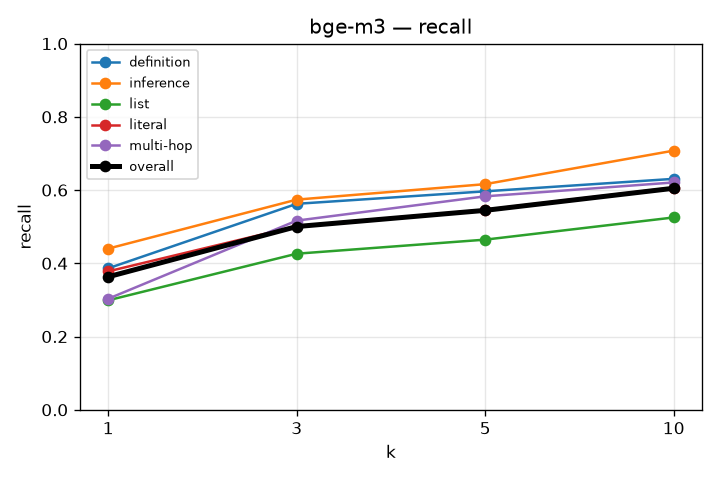
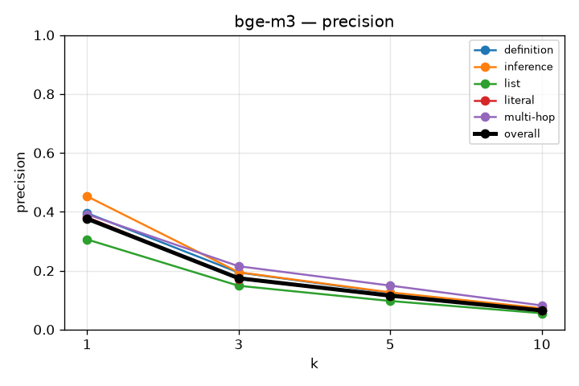
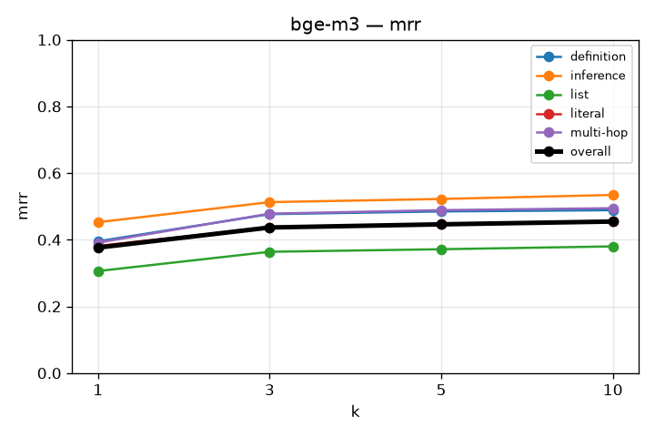
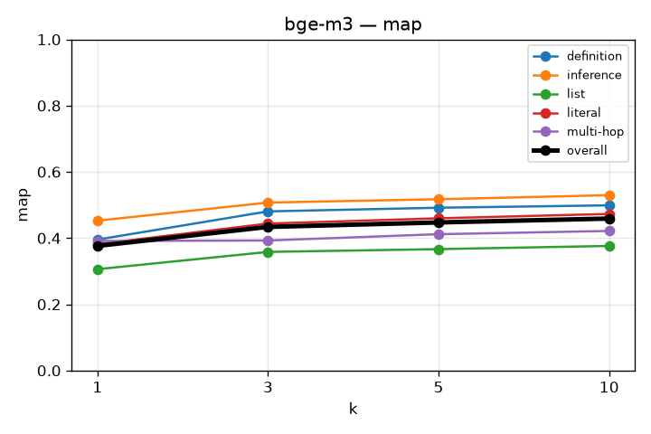
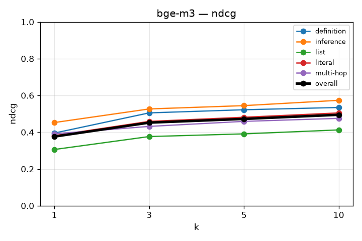

# RAG Retrieval Evaluation

## bge-m3
`kb_id=-7vyczRJAdpKd-B44nGLe`

```json
{
  "chunkingMethod": "semantic",
  "maxChunkSize": 1024,
  "minChunkSize": 512,
  "indexTypes": [
    "BAAI/bge-m3"
  ]
}
```
redo the comparison on bge vs bm25 because RRF bug on qdrant is lowering the scores. 

### recall

| k | overall | definition | inference | list | literal | multi-hop |
|---|---|---|---|---|---|---|
| 1 | 0.363 | 0.386 | 0.440 | 0.299 | 0.378 | 0.303 |
| 3 | 0.500 | 0.562 | 0.574 | 0.426 | 0.502 | 0.517 |
| 5 | 0.545 | 0.597 | 0.616 | 0.465 | 0.546 | 0.583 |
| 10 | 0.605 | 0.631 | 0.708 | 0.525 | 0.607 | 0.621 |



### precision

| k | overall | definition | inference | list | literal | multi-hop |
|---|---|---|---|---|---|---|
| 1 | 0.376 | 0.395 | 0.453 | 0.306 | 0.382 | 0.391 |
| 3 | 0.174 | 0.194 | 0.195 | 0.149 | 0.172 | 0.215 |
| 5 | 0.115 | 0.124 | 0.126 | 0.097 | 0.114 | 0.149 |
| 10 | 0.065 | 0.066 | 0.072 | 0.055 | 0.064 | 0.082 |



### mrr

| k | overall | definition | inference | list | literal | multi-hop |
|---|---|---|---|---|---|---|
| 1 | 0.376 | 0.395 | 0.453 | 0.306 | 0.382 | 0.391 |
| 3 | 0.437 | 0.477 | 0.513 | 0.364 | 0.437 | 0.478 |
| 5 | 0.446 | 0.485 | 0.522 | 0.372 | 0.447 | 0.489 |
| 10 | 0.455 | 0.489 | 0.534 | 0.380 | 0.456 | 0.495 |



### map

| k | overall | definition | inference | list | literal | multi-hop |
|---|---|---|---|---|---|---|
| 1 | 0.376 | 0.395 | 0.453 | 0.306 | 0.382 | 0.391 |
| 3 | 0.434 | 0.481 | 0.507 | 0.358 | 0.444 | 0.393 |
| 5 | 0.447 | 0.492 | 0.517 | 0.367 | 0.460 | 0.412 |
| 10 | 0.459 | 0.499 | 0.530 | 0.376 | 0.473 | 0.422 |



### ndcg

| k | overall | definition | inference | list | literal | multi-hop |
|---|---|---|---|---|---|---|
| 1 | 0.376 | 0.395 | 0.453 | 0.306 | 0.382 | 0.391 |
| 3 | 0.452 | 0.505 | 0.527 | 0.376 | 0.459 | 0.432 |
| 5 | 0.472 | 0.522 | 0.545 | 0.391 | 0.481 | 0.459 |
| 10 | 0.495 | 0.534 | 0.573 | 0.412 | 0.505 | 0.475 |


