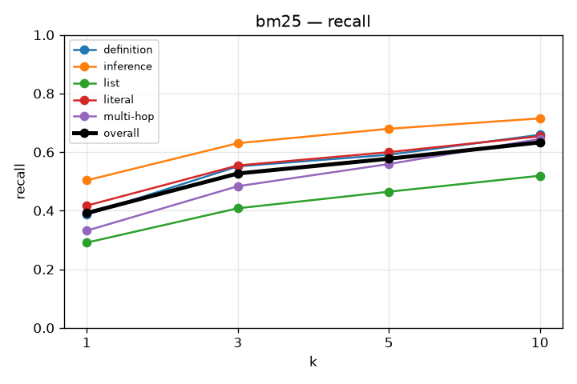
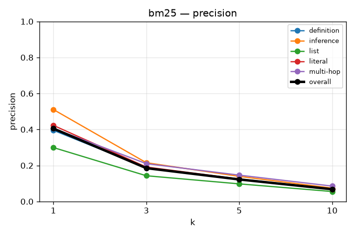
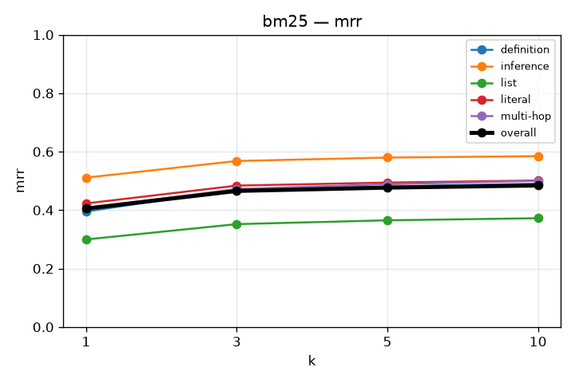
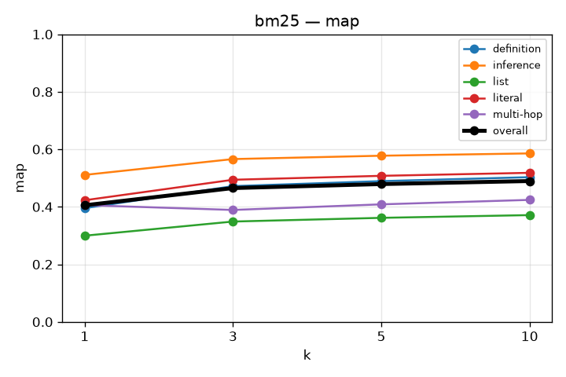
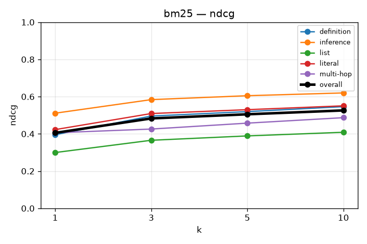

# RAG Retrieval Evaluation

## bm25
`kb_id=xgqnImqNxTB9GDSUDpyRd`

```json
{
  "chunkingMethod": "semantic",
  "maxChunkSize": 1024,
  "minChunkSize": 512,
  "indexTypes": [
    "bm25"
  ]
}
```
redo the comparison on bge vs bm25 because RRF bug on qdrant is lowering the scores. 

### recall

| k | overall | definition | inference | list | literal | multi-hop |
|---|---|---|---|---|---|---|
| 1 | 0.392 | 0.386 | 0.504 | 0.291 | 0.417 | 0.332 |
| 3 | 0.527 | 0.551 | 0.630 | 0.408 | 0.554 | 0.483 |
| 5 | 0.577 | 0.591 | 0.680 | 0.465 | 0.600 | 0.559 |
| 10 | 0.633 | 0.659 | 0.715 | 0.519 | 0.654 | 0.645 |



### precision

| k | overall | definition | inference | list | literal | multi-hop |
|---|---|---|---|---|---|---|
| 1 | 0.405 | 0.395 | 0.511 | 0.300 | 0.423 | 0.406 |
| 3 | 0.185 | 0.188 | 0.215 | 0.143 | 0.191 | 0.210 |
| 5 | 0.122 | 0.124 | 0.139 | 0.098 | 0.125 | 0.146 |
| 10 | 0.068 | 0.070 | 0.074 | 0.055 | 0.069 | 0.086 |



### mrr

| k | overall | definition | inference | list | literal | multi-hop |
|---|---|---|---|---|---|---|
| 1 | 0.405 | 0.395 | 0.511 | 0.300 | 0.423 | 0.406 |
| 3 | 0.466 | 0.472 | 0.568 | 0.352 | 0.484 | 0.472 |
| 5 | 0.477 | 0.481 | 0.580 | 0.365 | 0.494 | 0.489 |
| 10 | 0.484 | 0.490 | 0.585 | 0.372 | 0.501 | 0.500 |



### map

| k | overall | definition | inference | list | literal | multi-hop |
|---|---|---|---|---|---|---|
| 1 | 0.405 | 0.395 | 0.511 | 0.300 | 0.423 | 0.406 |
| 3 | 0.465 | 0.472 | 0.566 | 0.349 | 0.494 | 0.389 |
| 5 | 0.479 | 0.489 | 0.578 | 0.362 | 0.508 | 0.409 |
| 10 | 0.490 | 0.503 | 0.586 | 0.371 | 0.518 | 0.424 |



### ndcg

| k | overall | definition | inference | list | literal | multi-hop |
|---|---|---|---|---|---|---|
| 1 | 0.405 | 0.395 | 0.511 | 0.300 | 0.423 | 0.406 |
| 3 | 0.483 | 0.496 | 0.584 | 0.366 | 0.509 | 0.426 |
| 5 | 0.505 | 0.519 | 0.605 | 0.389 | 0.530 | 0.458 |
| 10 | 0.526 | 0.546 | 0.620 | 0.409 | 0.551 | 0.487 |


