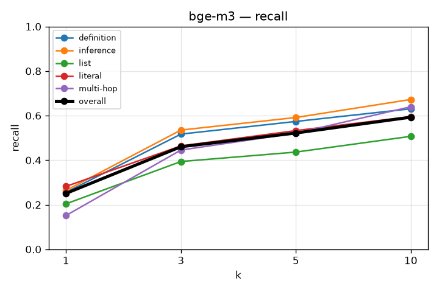
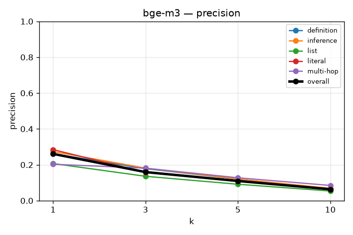
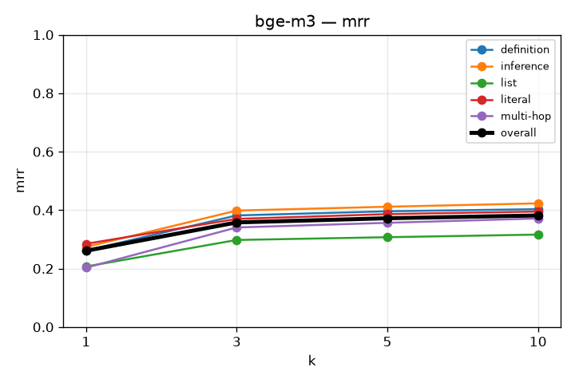
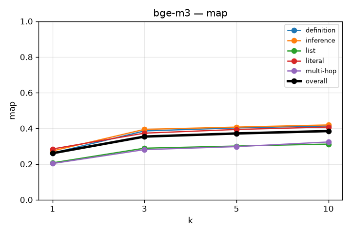
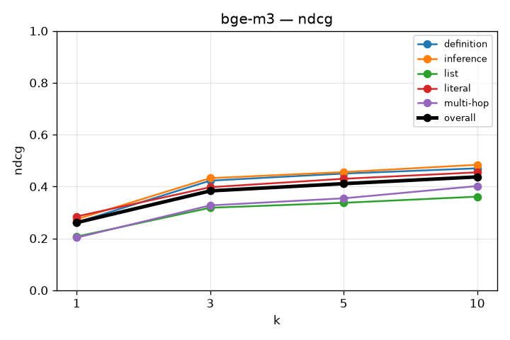

# RAG Retrieval Evaluation

## bge-m3
`kb_id=-7vyczRJAdpKd-B44nGLe`

```json
{
  "chunkingMethod": "semantic",
  "maxChunkSize": 1024,
  "minChunkSize": 512,
  "indexTypes": [
    "BAAI/bge-m3"
  ]
}
```
this is experiment with pure dense embedding.

### recall

| k | overall | definition | inference | list | literal | multi-hop |
|---|---|---|---|---|---|---|
| 1 | 0.251 | 0.256 | 0.264 | 0.204 | 0.282 | 0.152 |
| 3 | 0.460 | 0.517 | 0.535 | 0.394 | 0.464 | 0.445 |
| 5 | 0.522 | 0.574 | 0.592 | 0.436 | 0.533 | 0.521 |
| 10 | 0.593 | 0.631 | 0.673 | 0.507 | 0.596 | 0.640 |



### precision

| k | overall | definition | inference | list | literal | multi-hop |
|---|---|---|---|---|---|---|
| 1 | 0.261 | 0.262 | 0.274 | 0.207 | 0.285 | 0.203 |
| 3 | 0.159 | 0.178 | 0.181 | 0.136 | 0.158 | 0.181 |
| 5 | 0.110 | 0.120 | 0.120 | 0.091 | 0.111 | 0.128 |
| 10 | 0.063 | 0.066 | 0.069 | 0.054 | 0.063 | 0.085 |



### mrr

| k | overall | definition | inference | list | literal | multi-hop |
|---|---|---|---|---|---|---|
| 1 | 0.261 | 0.262 | 0.274 | 0.207 | 0.285 | 0.203 |
| 3 | 0.358 | 0.382 | 0.398 | 0.298 | 0.370 | 0.341 |
| 5 | 0.372 | 0.396 | 0.412 | 0.307 | 0.386 | 0.357 |
| 10 | 0.382 | 0.403 | 0.423 | 0.316 | 0.395 | 0.371 |



### map

| k | overall | definition | inference | list | literal | multi-hop |
|---|---|---|---|---|---|---|
| 1 | 0.261 | 0.262 | 0.274 | 0.207 | 0.285 | 0.203 |
| 3 | 0.354 | 0.386 | 0.394 | 0.289 | 0.373 | 0.281 |
| 5 | 0.371 | 0.403 | 0.407 | 0.301 | 0.394 | 0.298 |
| 10 | 0.385 | 0.414 | 0.419 | 0.312 | 0.408 | 0.324 |



### ndcg

| k | overall | definition | inference | list | literal | multi-hop |
|---|---|---|---|---|---|---|
| 1 | 0.261 | 0.262 | 0.274 | 0.207 | 0.285 | 0.203 |
| 3 | 0.383 | 0.423 | 0.432 | 0.318 | 0.397 | 0.327 |
| 5 | 0.411 | 0.450 | 0.456 | 0.337 | 0.430 | 0.355 |
| 10 | 0.437 | 0.470 | 0.484 | 0.361 | 0.455 | 0.402 |


