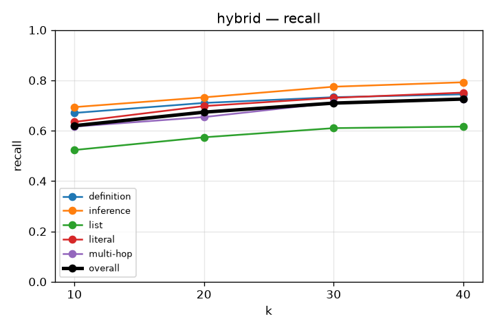
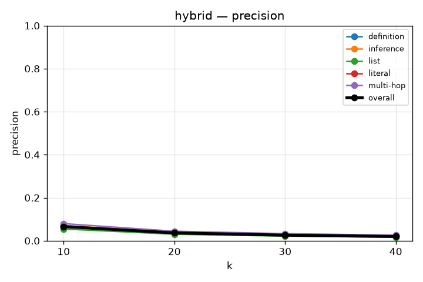
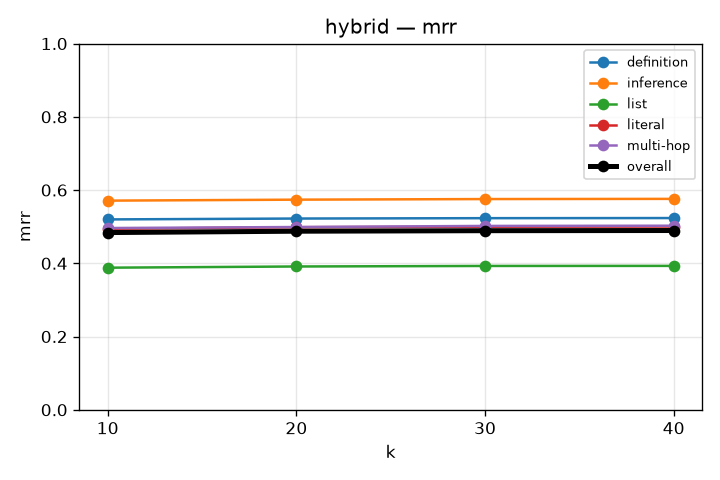
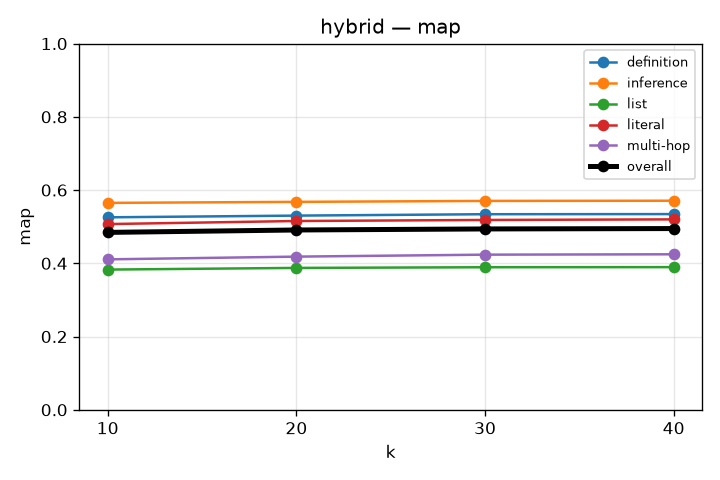
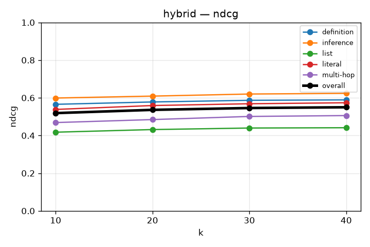

# RAG Retrieval Evaluation

## hybrid
`kb_id=OZDhpCgx45ClVNskRLZNY`

```json
{
  "chunkingMethod": "semantic",
  "maxChunkSize": 1024,
  "minChunkSize": 512,
  "indexTypes": [
    "BAAI/bge-m3",
    "bm25"
  ]
}
```
widening K: exp 5-k-widen

### recall

| k | overall | definition | inference | list | literal | multi-hop |
|---|---|---|---|---|---|---|
| 10 | 0.620 | 0.670 | 0.694 | 0.523 | 0.635 | 0.616 |
| 20 | 0.674 | 0.710 | 0.732 | 0.574 | 0.698 | 0.654 |
| 30 | 0.710 | 0.733 | 0.775 | 0.610 | 0.730 | 0.711 |
| 40 | 0.726 | 0.744 | 0.792 | 0.616 | 0.751 | 0.725 |



### precision

| k | overall | definition | inference | list | literal | multi-hop |
|---|---|---|---|---|---|---|
| 10 | 0.066 | 0.070 | 0.071 | 0.055 | 0.067 | 0.080 |
| 20 | 0.036 | 0.038 | 0.038 | 0.030 | 0.037 | 0.044 |
| 30 | 0.026 | 0.027 | 0.027 | 0.022 | 0.026 | 0.033 |
| 40 | 0.020 | 0.020 | 0.021 | 0.016 | 0.021 | 0.026 |



### mrr

| k | overall | definition | inference | list | literal | multi-hop |
|---|---|---|---|---|---|---|
| 10 | 0.484 | 0.520 | 0.571 | 0.388 | 0.494 | 0.496 |
| 20 | 0.488 | 0.522 | 0.574 | 0.391 | 0.499 | 0.499 |
| 30 | 0.489 | 0.523 | 0.575 | 0.393 | 0.500 | 0.502 |
| 40 | 0.490 | 0.524 | 0.576 | 0.393 | 0.500 | 0.503 |



### map

| k | overall | definition | inference | list | literal | multi-hop |
|---|---|---|---|---|---|---|
| 10 | 0.484 | 0.526 | 0.565 | 0.383 | 0.507 | 0.411 |
| 20 | 0.491 | 0.530 | 0.568 | 0.387 | 0.516 | 0.418 |
| 30 | 0.494 | 0.534 | 0.570 | 0.389 | 0.518 | 0.424 |
| 40 | 0.495 | 0.534 | 0.571 | 0.390 | 0.520 | 0.425 |



### ndcg

| k | overall | definition | inference | list | literal | multi-hop |
|---|---|---|---|---|---|---|
| 10 | 0.519 | 0.565 | 0.599 | 0.418 | 0.538 | 0.469 |
| 20 | 0.536 | 0.578 | 0.609 | 0.432 | 0.559 | 0.485 |
| 30 | 0.546 | 0.587 | 0.620 | 0.440 | 0.569 | 0.501 |
| 40 | 0.550 | 0.589 | 0.624 | 0.441 | 0.574 | 0.506 |


