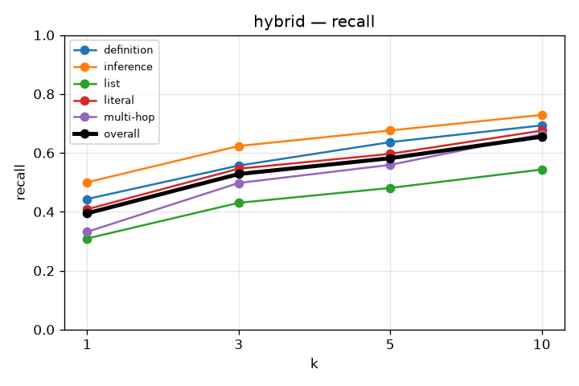
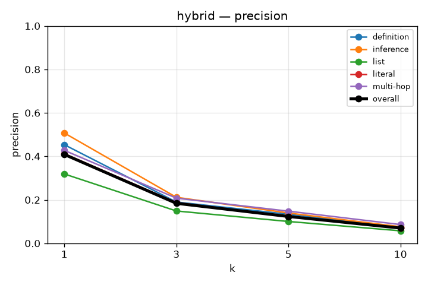
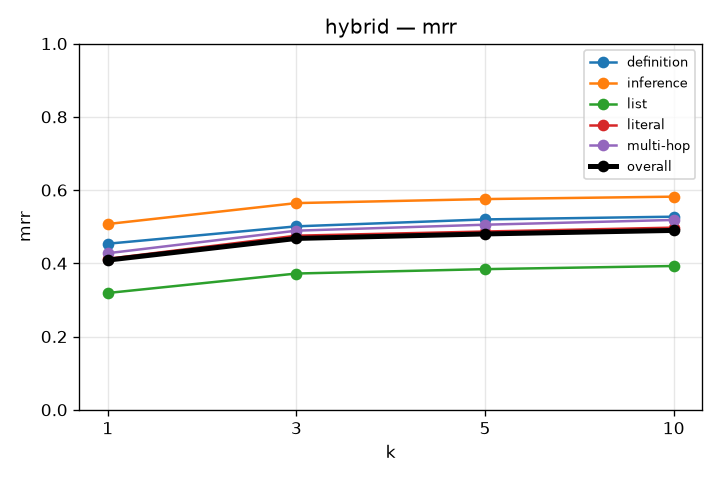
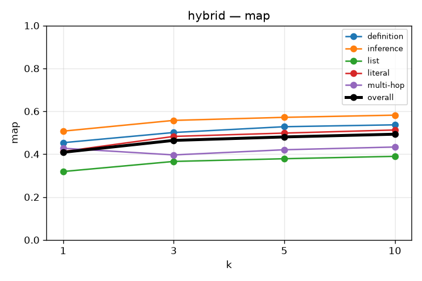
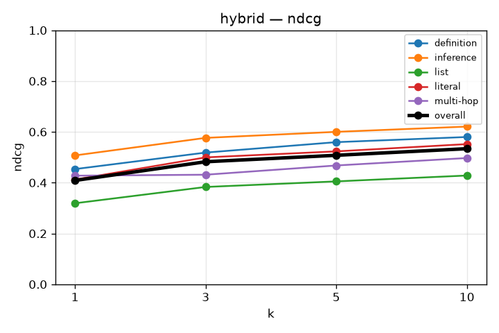

# RAG Retrieval Evaluation

## hybrid
`kb_id=OZDhpCgx45ClVNskRLZNY`

```json
{
  "chunkingMethod": "semantic",
  "maxChunkSize": 1024,
  "minChunkSize": 512,
  "indexTypes": [
    "BAAI/bge-m3",
    "bm25"
  ]
}
```
After widening the prefetch limit to qdrant to 2 * top_k, we have some improvement.

### recall

| k | overall | definition | inference | list | literal | multi-hop |
|---|---|---|---|---|---|---|
| 1 | 0.395 | 0.443 | 0.500 | 0.309 | 0.408 | 0.332 |
| 3 | 0.528 | 0.557 | 0.623 | 0.430 | 0.546 | 0.498 |
| 5 | 0.582 | 0.636 | 0.676 | 0.481 | 0.596 | 0.559 |
| 10 | 0.655 | 0.693 | 0.729 | 0.543 | 0.675 | 0.664 |



### precision

| k | overall | definition | inference | list | literal | multi-hop |
|---|---|---|---|---|---|---|
| 1 | 0.409 | 0.453 | 0.507 | 0.319 | 0.412 | 0.428 |
| 3 | 0.184 | 0.190 | 0.212 | 0.149 | 0.188 | 0.208 |
| 5 | 0.123 | 0.134 | 0.139 | 0.100 | 0.124 | 0.148 |
| 10 | 0.070 | 0.073 | 0.076 | 0.058 | 0.071 | 0.086 |



### mrr

| k | overall | definition | inference | list | literal | multi-hop |
|---|---|---|---|---|---|---|
| 1 | 0.409 | 0.453 | 0.507 | 0.319 | 0.412 | 0.428 |
| 3 | 0.468 | 0.501 | 0.564 | 0.372 | 0.475 | 0.489 |
| 5 | 0.480 | 0.520 | 0.575 | 0.384 | 0.487 | 0.505 |
| 10 | 0.490 | 0.527 | 0.582 | 0.393 | 0.497 | 0.518 |



### map

| k | overall | definition | inference | list | literal | multi-hop |
|---|---|---|---|---|---|---|
| 1 | 0.409 | 0.453 | 0.507 | 0.319 | 0.412 | 0.428 |
| 3 | 0.464 | 0.501 | 0.557 | 0.366 | 0.483 | 0.396 |
| 5 | 0.480 | 0.528 | 0.572 | 0.379 | 0.498 | 0.421 |
| 10 | 0.493 | 0.537 | 0.582 | 0.390 | 0.513 | 0.433 |



### ndcg

| k | overall | definition | inference | list | literal | multi-hop |
|---|---|---|---|---|---|---|
| 1 | 0.409 | 0.453 | 0.507 | 0.319 | 0.412 | 0.428 |
| 3 | 0.482 | 0.518 | 0.576 | 0.383 | 0.500 | 0.431 |
| 5 | 0.508 | 0.560 | 0.600 | 0.405 | 0.523 | 0.468 |
| 10 | 0.534 | 0.580 | 0.621 | 0.428 | 0.552 | 0.497 |


