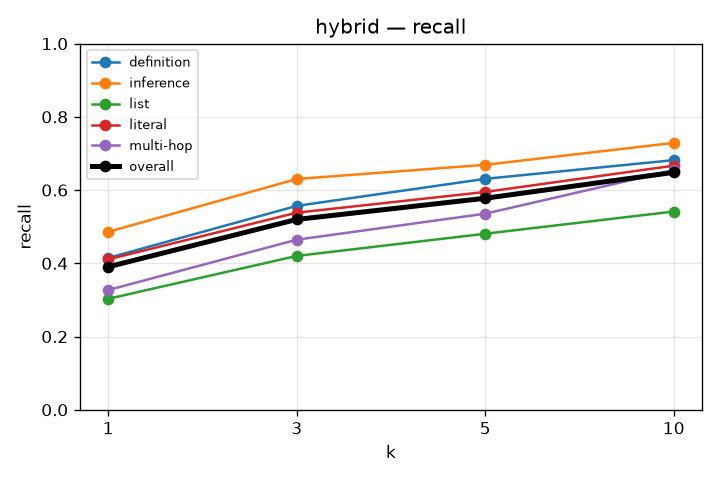
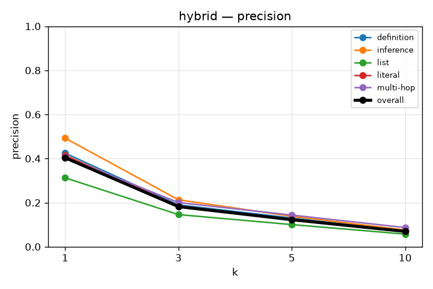
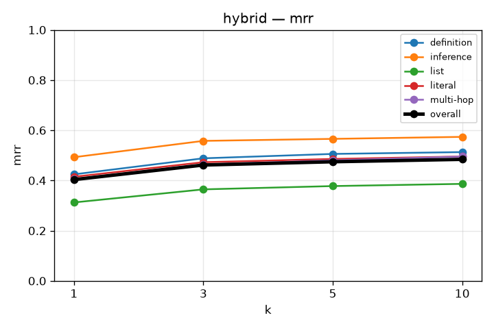
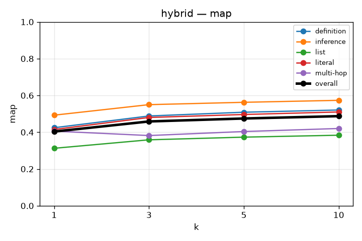
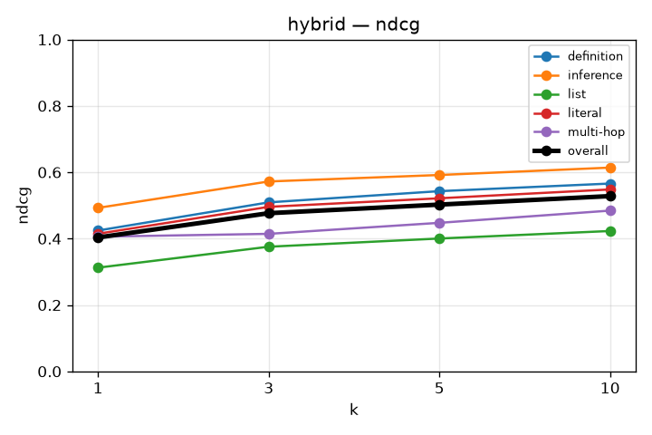

# RAG Retrieval Evaluation

## hybrid
`kb_id=OZDhpCgx45ClVNskRLZNY`

```json
{
  "chunkingMethod": "semantic",
  "maxChunkSize": 1024,
  "minChunkSize": 512,
  "indexTypes": [
    "BAAI/bge-m3",
    "bm25"
  ]
}
```
experiment with RRF: exp 5

### recall

| k | overall | definition | inference | list | literal | multi-hop |
|---|---|---|---|---|---|---|
| 1 | 0.390 | 0.415 | 0.486 | 0.303 | 0.411 | 0.327 |
| 3 | 0.520 | 0.557 | 0.630 | 0.420 | 0.538 | 0.464 |
| 5 | 0.578 | 0.631 | 0.669 | 0.481 | 0.595 | 0.536 |
| 10 | 0.648 | 0.682 | 0.729 | 0.541 | 0.667 | 0.654 |



### precision

| k | overall | definition | inference | list | literal | multi-hop |
|---|---|---|---|---|---|---|
| 1 | 0.404 | 0.424 | 0.493 | 0.312 | 0.415 | 0.406 |
| 3 | 0.182 | 0.190 | 0.213 | 0.146 | 0.185 | 0.200 |
| 5 | 0.123 | 0.130 | 0.138 | 0.100 | 0.124 | 0.143 |
| 10 | 0.069 | 0.072 | 0.076 | 0.057 | 0.070 | 0.087 |



### mrr

| k | overall | definition | inference | list | literal | multi-hop |
|---|---|---|---|---|---|---|
| 1 | 0.404 | 0.424 | 0.493 | 0.312 | 0.415 | 0.406 |
| 3 | 0.462 | 0.488 | 0.558 | 0.365 | 0.473 | 0.464 |
| 5 | 0.475 | 0.506 | 0.566 | 0.378 | 0.486 | 0.480 |
| 10 | 0.484 | 0.513 | 0.574 | 0.387 | 0.496 | 0.496 |



### map

| k | overall | definition | inference | list | literal | multi-hop |
|---|---|---|---|---|---|---|
| 1 | 0.404 | 0.424 | 0.493 | 0.312 | 0.415 | 0.406 |
| 3 | 0.459 | 0.488 | 0.550 | 0.359 | 0.480 | 0.382 |
| 5 | 0.475 | 0.509 | 0.563 | 0.373 | 0.496 | 0.404 |
| 10 | 0.487 | 0.521 | 0.573 | 0.384 | 0.510 | 0.420 |



### ndcg

| k | overall | definition | inference | list | literal | multi-hop |
|---|---|---|---|---|---|---|
| 1 | 0.404 | 0.424 | 0.493 | 0.312 | 0.415 | 0.406 |
| 3 | 0.477 | 0.509 | 0.572 | 0.376 | 0.496 | 0.414 |
| 5 | 0.503 | 0.543 | 0.592 | 0.400 | 0.522 | 0.448 |
| 10 | 0.528 | 0.566 | 0.614 | 0.423 | 0.548 | 0.484 |


