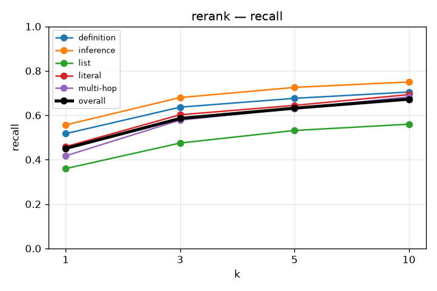
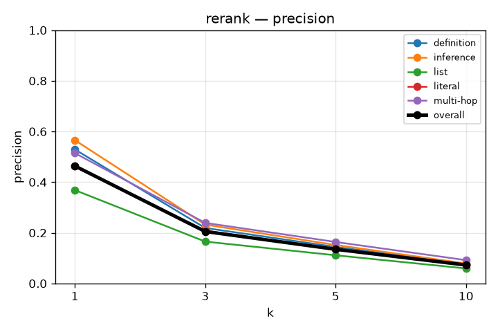
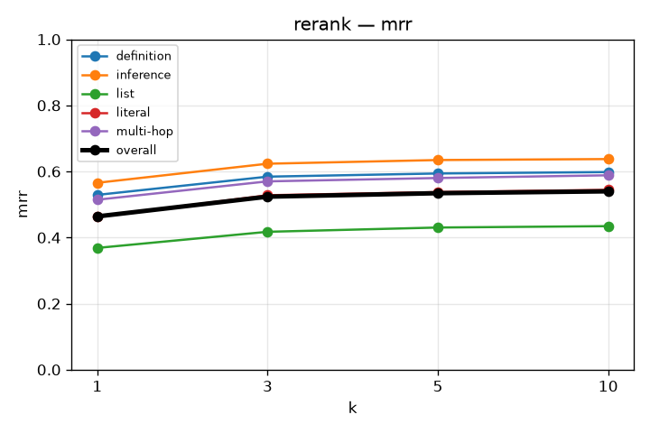
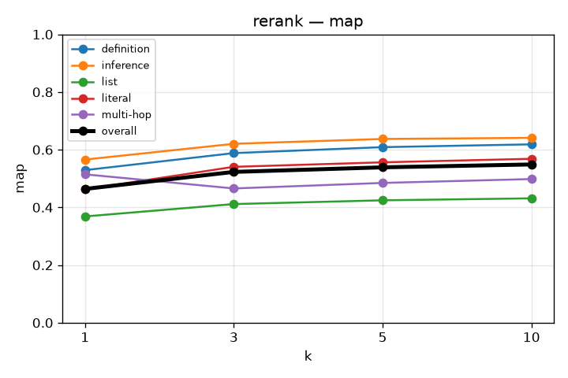
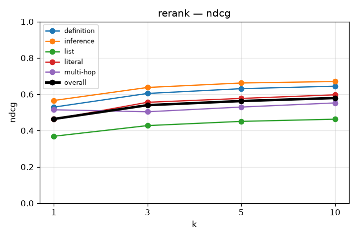

# RAG Retrieval Evaluation

## rerank
`kb_id=OZDhpCgx45ClVNskRLZNY`

```json
{
  "chunkingMethod": "semantic",
  "maxChunkSize": 1024,
  "minChunkSize": 512,
  "indexTypes": [
    "BAAI/bge-m3",
    "bm25"
  ],
  "rerankOn": "child",
  "rerankPool": 50
}
```

### recall

| k | overall | definition | inference | list | literal | multi-hop |
|---|---|---|---|---|---|---|
| 1 | 0.450 | 0.517 | 0.556 | 0.360 | 0.459 | 0.417 |
| 3 | 0.586 | 0.636 | 0.680 | 0.475 | 0.602 | 0.578 |
| 5 | 0.632 | 0.676 | 0.725 | 0.531 | 0.644 | 0.630 |
| 10 | 0.672 | 0.705 | 0.750 | 0.560 | 0.693 | 0.682 |



### precision

| k | overall | definition | inference | list | literal | multi-hop |
|---|---|---|---|---|---|---|
| 1 | 0.464 | 0.529 | 0.566 | 0.369 | 0.462 | 0.514 |
| 3 | 0.205 | 0.219 | 0.232 | 0.165 | 0.208 | 0.239 |
| 5 | 0.135 | 0.144 | 0.152 | 0.111 | 0.135 | 0.164 |
| 10 | 0.073 | 0.076 | 0.079 | 0.059 | 0.074 | 0.092 |



### mrr

| k | overall | definition | inference | list | literal | multi-hop |
|---|---|---|---|---|---|---|
| 1 | 0.464 | 0.529 | 0.566 | 0.369 | 0.462 | 0.514 |
| 3 | 0.524 | 0.584 | 0.623 | 0.417 | 0.528 | 0.570 |
| 5 | 0.534 | 0.594 | 0.635 | 0.430 | 0.538 | 0.580 |
| 10 | 0.540 | 0.598 | 0.638 | 0.434 | 0.544 | 0.588 |



### map

| k | overall | definition | inference | list | literal | multi-hop |
|---|---|---|---|---|---|---|
| 1 | 0.464 | 0.529 | 0.566 | 0.369 | 0.462 | 0.514 |
| 3 | 0.523 | 0.588 | 0.620 | 0.411 | 0.541 | 0.466 |
| 5 | 0.539 | 0.609 | 0.637 | 0.424 | 0.556 | 0.485 |
| 10 | 0.549 | 0.619 | 0.641 | 0.431 | 0.568 | 0.498 |



### ndcg

| k | overall | definition | inference | list | literal | multi-hop |
|---|---|---|---|---|---|---|
| 1 | 0.464 | 0.529 | 0.566 | 0.369 | 0.462 | 0.514 |
| 3 | 0.540 | 0.604 | 0.637 | 0.427 | 0.556 | 0.504 |
| 5 | 0.563 | 0.631 | 0.662 | 0.451 | 0.577 | 0.530 |
| 10 | 0.579 | 0.644 | 0.670 | 0.463 | 0.597 | 0.552 |


